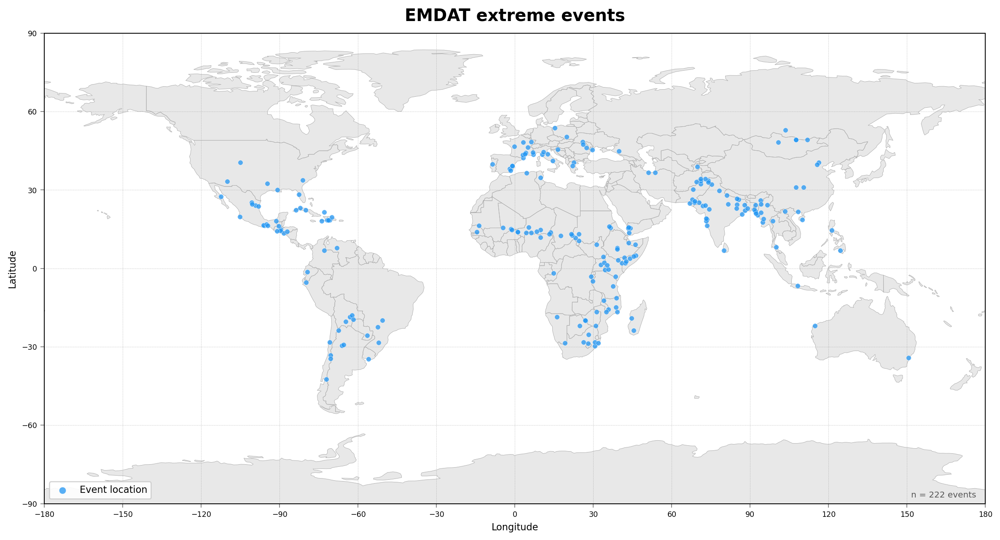
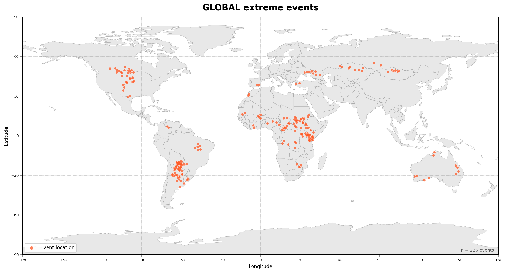
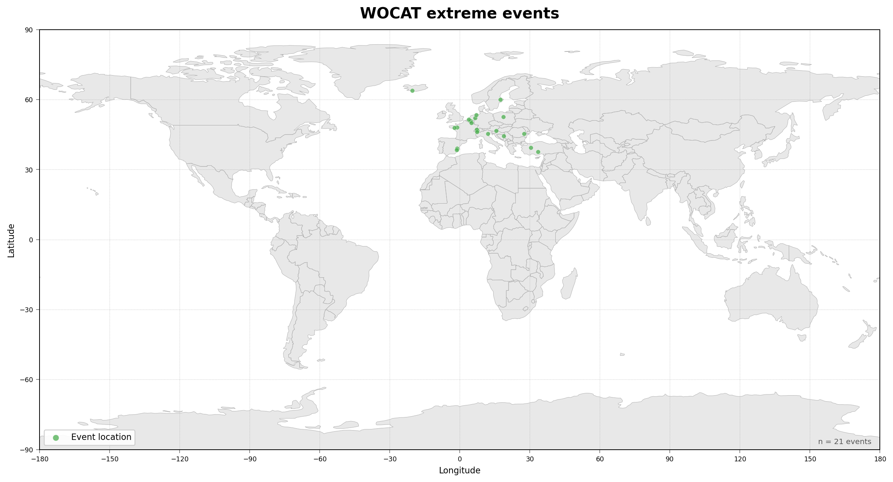

# ARCEME Data Cube Pipeline - Usage Guide

[](https://opensource.org/licenses/MIT)
[](https://www.python.org/downloads/)
[](https://github.com/astral-sh/uv)
[](https://www.docker.com/)


## Overview

ARCEME Data Cube Pipeline is an end-to-end orchestrator for building spatiotemporal satellite datacubes around disaster event locations. It takes a CSV of coordinates and event dates, queries Sentinel-2 L2A, Sentinel-1 RTC, Copernicus DEM, and ESA WorldCover, applies deep-learning-based cloud masking via SEnSeIv2, and merges all sources into a single rechunked Zarr archive — analysis-ready out of the box. Designed for batch processing of large location sets, with built-in resume support, Docker compatibility, and a single YAML configuration file.

The pipeline orchestrator creates multi-source satellite datacubes for ARCEME project locations. It processes following datasets:
- **Sentinel-2 L2A** 
- **Sentinel-1 RTC** 
- **Copernicus DEM** 
- **ESA WorldCover**

## Quick Start

1. **Install `uv`** (if not installed):
```bash
curl -LsSf https://astral.sh/uv/install.sh | sh
source "$HOME/.local/bin/env"  # or restart your shell
```

2. **Sync dependencies from project root**:
```bash
cd /home/eouser/datacubes/data-cubes-arceme
uv sync
```

3. **Edit configuration**: Open `src/processor/pipeline_config.yaml` and adjust paths, dates, and settings

4. **Run pipeline**:
```bash
uv run python src/processor/pipeline_orchestrator.py
```

5. **Use custom config** (optional):
```bash
uv run python src/processor/pipeline_orchestrator.py --config /path/to/custom_config.yaml
```

## Run Full Workflow Yourself (from your YAML)

If you already fixed your YAML (for example `src/processor/new_locations_test_config.yaml`), run the full pipeline with:

```bash
cd /home/eouser/datacubes/data-cubes-arceme
uv sync
uv run python src/processor/pipeline_orchestrator.py --config src/processor/new_locations_test_config.yaml
```

This command runs all enabled stages from config:
1. S2
2. S1
3. COPDEM
4. ESALC
5. Cloud mask (if `cloud_mask.enabled: true`)
6. Merge (if `merge.enabled: true`)

### Recommended: run in tmux

For long runs, start in `tmux` so it keeps running after disconnect:

```bash
tmux new -s arceme_workflow
cd /home/eouser/datacubes/data-cubes-arceme
uv run python src/processor/pipeline_orchestrator.py --config src/processor/new_locations_test_config.yaml |& tee /ARCEME-MERGE/NEW_LOCATIONS_MELANIE/run_manual.log
```

Useful tmux commands:
```bash
# detach from session
Ctrl+b then d

# return to session
tmux attach -t arceme_workflow
```

### Check progress while running

```bash
for d in S2L2A S2L2A_CLOUDMASK S1RTC COPDEM ESALC MERGED; do
  echo "$d $(find /ARCEME-MERGE/NEW_LOCATIONS_MELANIE/$d -mindepth 1 -maxdepth 1 -type d | wc -l)"
done
```

```bash
tail -n 80 /ARCEME-MERGE/NEW_LOCATIONS_MELANIE/run_manual.log
```

## Docker Run

You can run the same full workflow in Docker without changing Python code.

### Build image

```bash
cd /home/eouser/datacubes/data-cubes-arceme
docker build -t arceme-pipeline:latest .
```

If you get `permission denied` on `/var/run/docker.sock`, use `sudo`:

```bash
sudo docker build -t arceme-pipeline:latest .
```

### Run with your YAML config

```bash
docker run --rm -it \
  --env-file /home/eouser/datacubes/data-cubes-arceme/.env \
  -e PIPELINE_CONFIG=src/processor/new_locations_test_config.yaml \
  -v /ARCEME-MERGE:/ARCEME-MERGE \
  arceme-pipeline:latest
```

`PIPELINE_CONFIG` is read by the Docker container and passed to `pipeline_orchestrator.py --config`.

### Run in tmux (recommended for long jobs)

```bash
tmux new -s arceme_docker
cd /home/eouser/datacubes/data-cubes-arceme
docker run --rm -it \
  --env-file /home/eouser/datacubes/data-cubes-arceme/.env \
  -e PIPELINE_CONFIG=src/processor/new_locations_test_config.yaml \
  -v /ARCEME-MERGE:/ARCEME-MERGE \
  arceme-pipeline:latest |& tee /ARCEME-MERGE/NEW_LOCATIONS_MELANIE/run_docker.log
```

### Monitor output

```bash
for d in S2L2A S2L2A_CLOUDMASK S1RTC COPDEM ESALC MERGED; do
  echo "$d $(find /ARCEME-MERGE/NEW_LOCATIONS_MELANIE/$d -mindepth 1 -maxdepth 1 -type d | wc -l)"
done
```

```bash
tail -n 80 /ARCEME-MERGE/NEW_LOCATIONS_MELANIE/run_docker.log
```

## Configuration File

The `pipeline_config.yaml` contains all pipeline settings:

### Key Settings

```yaml
# Input CSV identifier column for output naming:
# preferred: uid
# fallback (legacy): DisNo.
# Required coordinate/date columns: longitude, latitude, and date
locations_csv: /path/to/locations.csv

# Skip locations that already exist in output directories
skip_existing: true

# Spatial parameters
spatial:
  edge_size: 10000  # meters (creates 10km x 10km tiles)
  resolution: 10    # pixel size in meters

# Time range relative to event date
temporal:
  increment_months: 12  # months before event
  decrement_months: 12  # months after event

# Data sources: 'cdse' or 'planetary'
sources:
  s2: cdse         # Sentinel-2 from CDSE
  s1: planetary    # Sentinel-1 from Planetary Computer
  copdem: cdse     # DEM from CDSE
  esalc: planetary # Land cover from Planetary Computer

# Enable cloud masking (adds ~30 min per location depends on batch size and CPU/GPU)
cloud_mask:
  enabled: true
  device: cpu      # or 'cuda' if GPU available

# One base path for all outputs (recommended)
output_base_dir: /ARCEMECUBES/MY_RUN

# Optional custom names for stage folders inside output_base_dir
# output_subdirs:
#   s2: S2L2A
#   s2_cloudmask: S2L2A_CLOUDMASK
#   s1: S1RTC
#   copdem: COPDEM
#   esalc: ESALC
#   merged: MERGED
```

### Static Layers

COPDEM and ESA WorldCover use fixed date ranges (not event-based):

```yaml
static_dates:
  copdem:
    start: "2010-01-01"
    end: "2024-12-31"
  esalc:
    start: "2019-01-01"  # WorldCover 2020 product
    end: "2020-12-31"
```

### Merge Settings

```yaml
merge:
  enabled: true
  chunk_time: 25   # temporal chunk size
  chunk_x: 500     # spatial chunks (500px = 5km at 10m resolution)
  chunk_y: 500
  vars_to_uint16:  # convert these variables to uint16 for compression
    - B01
    - B02
    # ... (all S2 bands, cloud_mask, SCL, ESA_LC)
```

## Pipeline Workflow

1. **Sentinel-2 L2A**: Creates cube from event_date ± temporal window
2. **Cloud Mask** (if enabled): Applies SEnSeIv2 model to S2 cube (there is possible to select different weights and -parameters in SEnSeIv2_config yaml)
3. **Sentinel-1 RTC**: Creates cube with same temporal window
4. **Copernicus DEM**: Creates cube with digital elevation model
5. **ESA WorldCover**: Creates cube with land cover
6. **Merge** (if enabled): Combines all sources, rechunks, adds metadata

## Output Format

Each stage produces Zarr archives:
```
DC__<location>__S2L2A__<UTM>__<dates>.zarr
DC__<location>__S2L2A_CLOUDMASK__<UTM>__<dates>.zarr
DC__<location>__S1RTC__<UTM>__<dates>.zarr
DC__<location>__COPDEM__<UTM>__<dates>.zarr
DC__<location>__ESALC__<UTM>__<dates>.zarr
DC__<location>__<UTM>__<dates>.zarr  (merged cube)
```

`<location>` is read from the `uid` column (preferred). If `uid` is missing, the pipeline uses legacy `DisNo.`.

## Skip Existing Logic

When `skip_existing: true`, the pipeline checks each output directory and skips locations that already have output files. This allows:
- Resuming interrupted runs
- Processing new locations without reprocessing old ones
- Selective reprocessing (delete specific outputs to reprocess only those)

## Dependencies

Dependencies are managed with `uv`.
All project dependencies are defined in `pyproject.toml` (with lockfile in `uv.lock`).
The `senseiv2` dependency is pulled from Git via `[tool.uv.sources]`.

Install `uv` from:
https://astral.sh/uv/install.sh

Initialize environment and install dependencies:
```bash
uv sync
```

Run any command in the project environment with:
```bash
uv run <command>
```

## Environment Variables (`.env`)

Create a `.env` file in the project root (`data-cubes-arceme/.env`) with your S3 credentials.
Use this full template (copy/paste into `.env`, do not commit real credentials):
```bash
# Choose ONE endpoint (uncomment the right one):
# CREODIAS users:
AWS_S3_ENDPOINT=eodata.cloudferro.com
# CDSE users:
AWS_S3_ENDPOINT=eodata.dataspace.copernicus.eu

AWS_ACCESS_KEY_ID=YOUR_ACCESS_KEY_ID
AWS_SECRET_ACCESS_KEY=YOUR_SECRET_ACCESS_KEY
AWS_HTTPS=YES
AWS_VIRTUAL_HOSTING=FALSE
GDAL_HTTP_TCP_KEEPALIVE=YES
GDAL_HTTP_UNSAFESSL=YES
GDAL_HTTP_MAX_RETRY=5
GDAL_HTTP_RETRY_DELAY=30
GDAL_HTTP_MAX_CONNECTIONS=2
CPL_VSIL_CURL_CACHE_SIZE=10000000000
CPL_VSIL_CURL_CHUNK_SIZE=67108864
CPL_VSIL_CURL_USE_HEAD=NO
GDAL_DISABLE_READDIR_ON_OPEN=EMPTY_DIR
```

Endpoint choice:
- If you are a CREODIAS user, use `eodata.cloudferro.com`.
- Otherwise, use CDSE endpoint `eodata.dataspace.copernicus.eu`.

For CDSE, generate S3 credentials first:
- Tutorial: https://documentation.dataspace.copernicus.eu/APIs/S3.html
- Credentials panel: https://eodata-s3keysmanager.dataspace.copernicus.eu/panel/s3-credentials

## Troubleshooting

**"Config file not found"**: Make sure `pipeline_config.yaml` exists in the same directory as `pipeline_orchestrator.py`

**"Invalid YAML"**: Check YAML syntax (proper indentation, no tabs, matching quotes)

**STAC API errors**: Network issues or API changes - check URLs in config

**Cloud mask slow**: Consider setting `cloud_mask.enabled: false` or use `device: cuda` if GPU available

**Memory errors**: Reduce `chunk_time`, `chunk_x`, or `chunk_y` in merge settings

## Project Structure

```
data-cubes-arceme/
├── src/processor/
│   ├── pipeline_orchestrator.py    # Main entry point
│   ├── pipeline_config.yaml        # Configuration file
│   ├── cloud_mask.py               # Cloud masking module
│   ├── utils.py                    # Shared utility functions
│   └── archive/                    # Old scripts (deprecated)
├── SEnSeIv2_config/
│   ├── config.yaml                 # Cloud mask model config
│   └── weights.pt                  # Cloud mask model weights
├── data/                           # Input CSV files with locations
├── test/                           # Test scripts
└── README.md                       # This file
```

### Active Files (Use These)
- `src/processor/pipeline_orchestrator.py` - Run this script
- `src/processor/pipeline_config.yaml` - Edit this config
- `src/processor/cloud_mask.py` - Cloud masking (called by orchestrator)
- `src/processor/utils.py` - Helper functions

### Archive (Do Not Use)
- `src/processor/archive/*` - Old standalone scripts replaced by orchestrator

### S3 public bucket with data cubes
* [ARCEME-DC-DHP-EMDAT](https://s3.waw4-1.cloudferro.com/swift/v1/ARCEME-DC-DHP-EMDAT/) — flood and storm extreme events (EM-DAT)
* [ARCEME-DC-DHP-GLOBAL](https://s3.waw4-1.cloudferro.com/swift/v1/ARCEME-DC-DHP-GLOBAL/) — global DHP/drought extreme events
* [ARCEME-DC-DHP-WOCAT](https://s3.waw4-1.cloudferro.com/swift/v1/ARCEME-DC-DHP-WOCAT/) — WOCAT extreme events

### Event location maps

Static global maps showing extreme event locations from each input CSV are generated by `datacubes-processor/visualize_events_map.py`:

```bash
cd datacubes-processor
python visualize_events_map.py
```

Outputs (saved to `datacubes-processor/`):

**EMDAT extreme events**


**GLOBAL extreme events**


**WOCAT extreme events**


Requires: `geopandas`, `matplotlib`, `geodatasets` (country borders downloaded and cached on first run).

### Maintainer contact
Marcin Kluczek (mkluczek@cloudferro.com) CloudFerro, Poland
